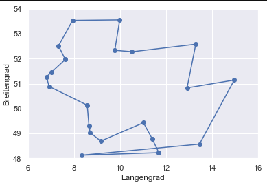

# Coding Challenge Traveling: Salesperson Problem
## by get-in-it.de 

Für die Lösung des Problems wurde der *Nearest Neighbour Algorithm* gewählt. 
Die *Brute Force* Methode, wwürde zwar defintiv die exakte und kürzeste Lösung ermitteln, dauert bei 21 Standorten aber
zu lang und ist zu rechenintensiv. Daher habe ich nach einem Algorithmus gesucht, mit dem ich eine möglichst gute Annäherung an die perfekte Lösung finde, aber der Algorithmus trotzdem noch relativ einfach und leicht verständlich ist. Andere Algorithmen, wie zum Beispiel das Erstellen eines *Minimum Spanning Tree* konnten außerdem bei der Konstellation der Städte nicht so ein zufriedenstellendes Ergebnisse erzielen wie die Nearest Neighbour Methode. 

---

Um das Skript auszuführen, müssen die drei Dateien heruntergeladen werden: 
* auswertung_nn.ipnyb
* klassen.py
* msg_standorte_deutschland.csv

Anschließend kann einfach das Jupyter Notebook (asuwertung_nn.ipnyb) ausgeführt werden (z.B. in Jupyter Lab, VS Code, ...).

---

Das optimale Tour, welche berechnet wurde, lautet: 

* Ismaning/München (Hauptsitz)
* Ingolstadt
* Nürnberg
* Stuttgart
* Bretten
* Walldorf
* Frankfurt
* Köln/Hürth
* Düsseldorf
* Essen
* Münster
* Lingen (Ems)
* Schortens/Wilhelmshaven
* Hamburg
* Hannover
* Braunschweig
* Berlin
* Chemnitz
* Görlitz
* Passau
* St. Georgen
* Ismaning/München (Hauptsitz)

mit einer insgesamt zurückgelegten Strecke von: **2743.83 Kilometer**

